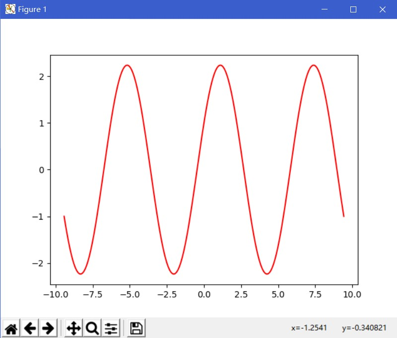

## 实验五 科学计算与可视化

<script type="text/javascript" src="http://cdn.mathjax.org/mathjax/latest/MathJax.js?config=default"></script>

#### 实验目的
1. 了解*Numpy*多维数组的概念，理解多维数组的广播概念。
2. 掌握*Numpy*多维数组的使用方法（初始化、索引、切片、简单的数组与矩阵运算）。
3. 了解*Matplotlib*库，能使用*Matplotlib*库绘制二维图形。

#### 实验内容
任务一：<br/>
&emsp;&emsp;运行实验指导中的cell中的语句，理解*Numpy*数组的创建方法，属性与常用操作。必要时修改语句，观察不同参数时语句的运行结果。<u>总结*Numpy*数组初始化、索引与切片、广播、数组与矩阵的相关操作。</u><br/>
###### 初始化
```
np.array([x,y,z],dtype=int) #从Python列表和元组创造数组
np.arange(x,y,i)            #创建一个由x到y，以i为步长的数组
np.linspace(x,y,n)          #创建一个由x到y，等分成n个元素的数组
np.indices((m,n))           #创建一个m行n列的矩阵
np.random.rand(m,n)         #创建一个m行n列的随机数组
np.ones((m,n),dtype)        #创建一个m行n列全1的数组，dtype是数据类型
np.empty((m,n),dtype)       #创建一个m行n列全0的数组，dtype是数据类型
```
###### 索引、切片
```
x[i]        #索引第i个元素
x[-i]       #从后向前索引第i个元素
x[n:m]      #默认步长为1，从前往后索引，不包含m
x[-m:-n]    #默认步长为1，从后往前索引，结束位置为n
x[n:m:i]    #指定i步长的由n到m的索引
```
###### 广播规则
>- 如果两个数组的维数不同，则维数较少的数组的形状，将在其左侧填充。
>- 如果两个数组的形状在任何维度上都不匹配，则该维度中形状等于1的数组将被拉伸来匹配其他形状。
>- 如果在任何维度中，大小不一致且都不等于1，则会引发错误。
>>引用自简书文章：[数据科学 IPython 笔记本 9.7 数组上的计算：广播](https://www.jianshu.com/p/e4ccb074ffdb)
1. 让所有输入数组都向其中shape最长的数组看齐，shape中不足的部分都通过在前面加1补齐；
2. 输出数组的shape是输入数组shape的各个轴上的最大值；
3. 如果输入数组的某个轴和输出数组的对应轴的长度相同或者其长度为1时，这个数组能够用来计算，否则出错；
4. 当输入数组的某个轴的长度为1时，沿着此轴运算时都能用此轴上的第一组值。

###### ndarray类的常用属性（7个）和形态操作方法（5个）
```
ndarray.ndim        #数组轴的个数，也被称作秩
ndarray.shape       #数组在每个维度上大小的整数元组
ndarray.size        #数组元素的总个数
ndarray.dtype       #数组元素的数据类型，dtype类型可以用于创建数组
ndarray.itemsize    #数组中每个元素的字节大小
ndarray.data        #包含实际数组元素的缓冲区地址
ndarray.flat        #数组元素的迭代器

ndarray.reshape(n,m)        #不改变数组ndarray，返回一个维度为(n,m)的数组
ndarray.resize(new_shape)   #与reshape()作用相同，直接修改数组ndarray
ndarray.swapaxes(ax1,ax2)   #将数组n个维度中任意两个维度进行调换
ndarray.flatten()           #对数组进行降维，返回一个折叠后的一维数组
ndarray.ravel()             #作用同np.flatten()，但是返回数组的一个视图
```

###### 矩阵的创建与运算
```
b = mat(a)                  #若a本身是矩阵，则不会创建新矩阵，而是建立引用
b = matrix(a)               #创建新的矩阵b
matrix(eye(2,dtype=int))    #生成一个二阶单位矩阵
matrix(diag([1,2,3]))       #生成一个对角线为1、2、3的对角矩阵
                            #l类似ndarray的有ones、zeros等

matrix(a)*matrix(b) #矩阵相乘
multiply(a,b)       #矩阵点乘
a*2                 #同上一行点乘
a.I                 #矩阵a的逆矩阵
a.T                 #矩阵a的转置

a.sum(axis=0)       #计算每一列的和，得到（1*列数）矩阵
a.sum(axis=1)       #计算每一行的和，得到（行数*1）矩阵
sum(a[i,:])         #计算第i+1行的和，得到一个数
sum(a[:,j])         #计算第j+1列的和，得到一个数
                    #类似的还有max（得到最大值）、argmax（得到最大值的索引）

a[i:,j:]            #分割出第i+1行以后的行和第j+1列以后的列的所有元素
c=vstack((a,b))     #按列合并，即增加行数
d=hstack((a,b))     #按行合并，即行数不变，扩展列数
```

任务二：<br/>
&emsp;&emsp;运行以上cell中的语句，掌握利用*matplotlib*绘制二维图形。<u>总结*matplotlib*绘制二维图形的基本步骤与注意要点。</u><br/>
###### matplotlib的简单操作
```
plt.plot(x,y,label,color,width) #根据x、y数组绘制直、曲线
plt.figure(figsize=None,facecolor=None(,dpi=n)) 
                                #创建一个全局绘图区域
plt.subplot(nrows,ncols,plot_number)    
                                #在全局绘图区域中创建一个子绘图区域
plt.xlim(xmin,xmax)             #设置当前x轴取值范围
plt.ylim(ymin,ymax)
plt.xticks(array,'a','b','c')   #设置当前x轴刻度位置的标签和值
plt.yticks(array,'a','b','c')
plt.xlabel(s)                   #设置当前x轴的标签
plt.ylabel(s)
plt.title()                     #设置标题
plt.show()                      #显示创建的绘图对象
```
任务三：<br/>
&emsp;&emsp;绘制 $y = 2 \times sinx + cosx$ 的曲线，横坐标范围为[$-3 \times \pi$ , $3 \times \pi$]，曲线为红色。实现代码如下：<br/>

```
import numpy as np
import matplotlib.pyplot as plt

from math import pi

x = np.linspace(-3*pi,3*pi,200)
y = 2*np.sin(x)+np.cos(x)
plt.plot(x,y,color='red')
plt.show()
```

###### 运行结果
&emsp;&emsp;


#### 【思考题】
&emsp;&emsp;*numpy.ndarray*看上去与*list*差不多。为什么不直接用*list*？<br/>
- Python 的 list 是动态类型，可以包含不同类型的元素，所以没有支持诸如点乘等数学函数，因为要为 list 实现这些操作会牺牲性能。
- Numpy 数组是 静态类型 并且 齐次。 元素类型在数组创建的时候就已经确定了。
- Numpy 数组节约内存。
- 由于是静态类型，对其数学操作函数（如矩阵乘法，矩阵加法）的实现可以使用 C 或者 Fortran 完成。
